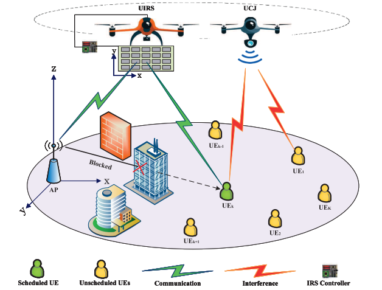

# Aerial IRS-Enabled THz Covert Communications in B5G-IoT Networks

> **MATLAB simulation code for the paper:**
> *"Aerial Intelligent Reflecting Surface Enabled Terahertz Covert Communications in Beyond-5G Internet of Things"*
> — Milad Tatar Mamaghani and Yi Hong, Monash University

[](https://www.mathworks.com/)
[](http://cvxr.com/cvx/)
[](LICENSE)

---

## Table of Contents

- [Research Summary](#research-summary)
- [Key Contributions](#key-contributions)
- [System Model](#system-model)
- [Repository Structure](#repository-structure)
- [Dependencies](#dependencies)
- [Installation](#installation)
- [How to Run](#how-to-run)
- [Reproducing Paper Results](#reproducing-paper-results)
- [Missing `.mat` Files](#missing-mat-files)
- [Citation](#citation)
- [Contact](#contact)

---

## Research Summary

This work proposes an **energy-efficient multi-UAV covert communication scheme** for **THz-band IoT networks**. The system consists of:

- A ground **Access Point (AP)** transmitting confidential data to scheduled ground IoT user equipment (UE), referred to as **Bob**
- A **UAV-mounted Intelligent Reflecting Surface (UIRS)** enabling reliable AP-to-Bob links at THz frequencies via passive beamforming
- A **UAV-mounted Cooperative Jammer (UCJ)** generating artificial noise (AN) to degrade detection by unscheduled UEs, referred to as **Willies**

Since unscheduled UEs may act as adversaries attempting to detect ongoing transmissions, the system is designed to maintain **covertness** (low probability of detection, LPD) while maximising **energy efficiency**.

The core objective is to maximise the **minimum Average Energy Efficiency (mAEE)**, defined as the minimum ratio of covert throughput to UAV propulsion power consumption across all UEs, subject to covertness constraints, power budgets, and UAV kinematics.

The non-convex optimisation problem is solved using a **Block Successive Convex Approximation (BSCA)** framework that iteratively optimises:

1. Binary user scheduling
2. AP transmit power allocation
3. UCJ maximum AN power
4. UIRS IRS passive beamforming
5. UIRS and UCJ trajectory and velocity planning

---

## Key Contributions

- Novel **mAEE** performance metric for energy-efficient covert UAV communications
- Analytical **covertness expressions** (missed detection and false alarm rates) for the UIRS-UCJ assisted THz system
- Tight **lower bound on average covert data rate** using Jensen's inequality
- Computationally efficient **BSCA algorithm** with convergence and complexity analysis
- Demonstrated significant gain over benchmark schemes (fixed trajectory, no user scheduling)

---

## System Model

<p align="center">
  
</p>

<p align="center">
  <em>Figure 1: UIRS-assisted THz covert communication system model.</em>
</p>

The UIRS and UCJ fly at fixed altitudes `Hr` and `Hj` respectively, over a mission of `T` seconds discretised into `N` time slots under a TDMA scheduling protocol.

---

## Repository Structure

```
UIRS-THz-CovertComm/
│
├── README.md                          # This file
├── LICENSE                            # MIT License
├── .gitignore                         # Git ignore rules
│
├── src/
│   ├── core/                          # Core system models and initialization
│   │   ├── SystemParams.m             # All system parameters (main config)
│   │   ├── SystemParams_fc.m          # System params for frequency sweep
│   │   ├── Flightconstants.m          # Rotary-wing UAV flight power constants
│   │   ├── Channels.m                 # THz channel gain computation (script)
│   │   ├── AEE_Calc.m                 # mAEE / mACT / APC objective calculator
│   │   ├── Feasible_Init.m            # Circular feasible trajectory initialization
│   │   ├── flight_pow.m               # UAV propulsion power model (function)
│   │   ├── flight_pow_cvxapprox.m     # CVX-compatible flight power approximation
│   │   └── myfunc_NLP.m               # Nonlinear programming helper
│   │
│   ├── optimization/                  # BSCA sub-problem solvers
│   │   ├── subProb1_Alt.m             # Sub-problem 1: User scheduling (active)
│   │   ├── subProb2_NEW.m             # Sub-problem 2: IRS beamforming (active)
│   │   ├── subProb3_Alt.m             # Sub-problem 3: Joint power allocation (active)
│   │   ├── subProb4.m                 # Sub-problem 4: UIRS trajectory & velocity
│   │   ├── subProb5.m                 # Sub-problem 5: UCJ trajectory & velocity
│   │   ├── subProb1.m                 # Alt. user scheduling (archived)
│   │   ├── subProb2.m                 # Alt. IRS beamforming (archived)
│   │   ├── subProb2_Alt.m             # Alt. IRS beamforming v2 (archived)
│   │   ├── subProb2_LowComplex.m      # Low-complexity IRS BF (archived)
│   │   ├── subProb3.m                 # Alt. power allocation (archived)
│   │   ├── subProb3_Joint.m           # Joint scheduling+power (archived)
│   │   ├── subProb4_feasibilityCheck.m    # Feasibility check for sub4
│   │   ├── subProb4_feasibilityCheck_NEW.m
│   │   ├── Sch_optim.m                # Continuous relaxation user scheduling (CVX)
│   │   ├── Sch_optim_bin.m            # Binary user scheduling (CVX)
│   │   ├── JointPowerWoRecast_optim.m # Joint power optimization (no recasting)
│   │   ├── JointPower_optim.m         # Joint power optimization (with recasting)
│   │   ├── JammingPow_optim.m         # UCJ AN power optimization (CVX)
│   │   ├── IRSbeamforming_optim.m     # IRS beamforming optimizer (CVX SDP)
│   │   ├── IRSbeamformingNEW_optim.m  # Updated IRS BF optimizer (CVX SDP)
│   │   ├── JointPowUsrSch_optim.m     # Joint power + scheduling optimizer
│   │   ├── UsrSchPow_optim.m          # User scheduling + power combined
│   │   ├── Trj_uavIRS_optim.m         # UIRS trajectory optimizer (CVX)
│   │   ├── Trj_CJU_optim.m            # UCJ trajectory optimizer (CVX)
│   │   └── cvx_funcs.m                # Shared CVX utility functions
│   │
│   └── utils/                         # Visualization and helper utilities
│       ├── UsrRandDist.m              # Uniform random user placement
│       ├── uavTrj.m                   # Trajectory plotting function
│       ├── Visulization.m             # Network topology visualization script
│       ├── print_results.m            # Formatted result display function
│       └── FeasibleCheck.m            # Constraint feasibility checker
│
├── simulations/                       # High-level algorithm scripts
│   ├── Proposed.m                     # PROPOSED: Joint Trajectory & CD (JTCD)
│   ├── Benchmark1.m                   # BENCHMARK I: Fixed trajectory, optimized CD
│   ├── Benchmark2.m                   # BENCHMARK II: Trajectory design, no scheduling
│   └── Globaloptim_AEE.m             # Global optimization reference (intlinprog)
│
├── experiments/                       # Top-level experiment runners
│   ├── Main.m                         # MAIN: Run all algorithms + generate figures
│   ├── Results.m                      # Legacy results script (archived)
│   └── Tst_usrSch.m                   # User scheduling test/debug script
│
├── data/
│   ├── raw/                           # (empty) Raw input data if applicable
│   ├── results/                       # Generated .mat result files (see below)
│   └── README_data.md                 # Documentation for .mat result files
│
├── figures/                           # Auto-saved figures (.fig + .eps)
├── docs/
│   ├── parameter_guide.md             # Explanation of all system parameters
│   └── algorithm_overview.md          # BSCA algorithm walkthrough
└── examples/
    └── quick_start.m                  # Minimal example: run proposed algorithm
```

---

## Dependencies

| Dependency | Version | Purpose |
|---|---|---|
| **MATLAB** | R2021a or later | Core simulation environment |
| **CVX** | 2.2+ | Convex optimization (sub-problems) |
| **MOSEK** | 9.0+ | CVX backend solver (recommended) |

> **Note:** SDPT3 or SeDuMi can be used as alternative CVX backends, but MOSEK is strongly recommended for performance and numerical stability.

### MATLAB Toolboxes Required

- Optimization Toolbox
- Signal Processing Toolbox (for `wrapTo2Pi`)
- Statistics and Machine Learning Toolbox (for `norms`)

---

## Installation

### 1. Clone the repository

```bash
git clone https://github.com/<your-username>/UIRS-THz-CovertComm.git
cd UIRS-THz-CovertComm
```

### 2. Install CVX

Download and install CVX from [http://cvxr.com/cvx/download/](http://cvxr.com/cvx/download/).

Then in MATLAB:
```matlab
cd /path/to/cvx
cvx_setup
```

### 3. Install MOSEK (Recommended)

Download MOSEK from [https://www.mosek.com/downloads/](https://www.mosek.com/downloads/) and obtain an academic license.

Then in MATLAB:
```matlab
cvx_solver mosek
```

### 4. Add source paths in MATLAB

```matlab
% Run this once before executing any simulation
addpath(genpath('src'));
addpath('simulations');
addpath('experiments');
```

Or permanently via `pathtool` in MATLAB.

---

## How to Run

### Quick Start (Single Algorithm)

```matlab
% From MATLAB, navigate to the repository root

% Step 1: Add source paths
addpath(genpath('src'));
addpath('simulations');

% Step 2: Set parameters
T = 30;         % Mission duration [s]
epsilon = 0.01; % Covertness constraint
N = 30;         % Number of time slots

% Step 3: Load system parameters
SystemParams

% Step 4: Run proposed algorithm
Proposed
```

### Run All Experiments and Generate Figures

```matlab
% Navigate to experiments/
cd experiments
Main
```

> ⚠️ **Warning:** The full `Main.m` script runs all algorithms across multiple parameter sweeps (IRS elements, carrier frequency). This may take **several hours** depending on hardware and solver speed.

### Run Individual Benchmarks

```matlab
addpath(genpath('src'));
addpath('simulations');
T = 30; epsilon = 0.01; N = 30;
SystemParams

% Benchmark I: Optimized communication design, fixed circular trajectory
Benchmark1

% Benchmark II: Optimized trajectory, no user scheduling or power control
Benchmark2
```

---

## Reproducing Paper Results

The following table maps paper figures to the scripts that generate them.

| Paper Figure | Description | Script |
|---|---|---|
| Fig. 1 | System model diagram | *(conceptual, no script)* |
| Fig. 2 | THz absorption vs. frequency | `src/core/SystemParams.m` (kappa model) |
| Fig. 3 | UAV trajectory (proposed vs. benchmarks) | `experiments/Main.m` → `TrjProp_*` |
| Fig. 4 | mAEE convergence vs. outer iteration | `experiments/Main.m` → `AEE_Itr_*` |
| Fig. 5 | mACT convergence vs. outer iteration | `experiments/Main.m` → `mACT_Itr_*` |
| Fig. 6 | APC convergence vs. outer iteration | `experiments/Main.m` → `APC_Itr_*` |
| Fig. 7 | Min. error detection rate over time | `experiments/Main.m` → `minZeta_Time_*` |
| Fig. 8 | UIRS velocity profile | `experiments/Main.m` → `UIRSvel_Time_*` |
| Fig. 9 | UCJ velocity profile | `experiments/Main.m` → `UCJvel_Time_*` |
| Fig. 10 | mAEE vs. number of IRS elements | `experiments/Main.m` → `IRSnum_*` |
| Fig. 11 | mAEE vs. carrier frequency | `experiments/Main.m` → `mAEEfreq_*` |

All figures are auto-saved in both `.fig` and `.eps` formats.

---

## Missing `.mat` Files

Several `.mat` result files are referenced in the scripts but are **not included** in the repository, as they are generated during simulation runs. These files are:

| File | Generated By | Contents |
|---|---|---|
| `myResults_T30eps1.mat` | `experiments/Main.m` | Proposed, Benchmark I & II results for `T=30`, `ε=0.01` |
| `myResults_T30eps5.mat` | `experiments/Main.m` | Same for `ε=0.05` |
| `AEE_IRS_scaled.mat` | `experiments/Main.m` (IRS sweep section) | mAEE vs. IRS element count |
| `mAEE_freq.mat` | `experiments/Main.m` (frequency sweep section) | mAEE vs. carrier frequency |

### How to generate them

Run the corresponding sections of `experiments/Main.m`. The scripts automatically save results using `save()` calls. Outputs are placed in the working directory; we recommend setting your working directory to `data/results/` before running:

```matlab
cd data/results
addpath(genpath('../../src'));
addpath('../../simulations');
```

> 💡 **Note:** If you simply want to reproduce the figures without re-running costly simulations, run the **plotting sections** of `Main.m` after loading existing `.mat` files (see clearly marked `%% ... plots` sections in `Main.m`).

---

## Algorithm Overview

The proposed BSCA algorithm solves the following optimisation problem iteratively:

```
maximise   min_{k} (1/N) Σ_n α_k[n] · R_k^lb[n] / P_f[n]
subject to
  C1: UAV trajectory & velocity constraints (UIRS)
  C2: UAV trajectory & velocity constraints (UCJ)
  C3: UAV-UAV minimum safety distance
  C4: Binary user scheduling (TDMA)
  C5: IRS phase shift / amplitude constraints
  C6: AP & UCJ power constraints
  C7: Covertness requirement  ζ_m[n] ≥ 1 - ε  ∀m, n
```

Each outer iteration cycles through **5 sub-problems**:

```
Outer Loop (convergence of mAEE)
 ├─ Sub-problem 1  →  User scheduling  (Sch_optim via CVX)
 ├─ Sub-problem 2  →  IRS beamforming  (IRSbeamformingNEW_optim via CVX SDP)
 ├─ Sub-problem 3  →  Joint power alloc. (JointPowerWoRecast_optim via CVX)
 ├─ Sub-problem 4  →  UIRS trajectory  (Trj_uavIRS_optim via CVX)
 └─ Sub-problem 5  →  UCJ trajectory   (Trj_CJU_optim via CVX)
```

See [`docs/algorithm_overview.md`](docs/algorithm_overview.md) for a detailed walkthrough.

---

## Citation

If you use this code in your research, please cite the following paper:

```bibtex
@article{mamaghani2023aerial,
  title     = {Aerial Intelligent Reflecting Surface Enabled Terahertz Covert
               Communications in Beyond-5G Internet of Things},
  author    = {Tatar Mamaghani, Milad and Hong, Yi},
  journal   = {IEEE Internet of Things Journal},
  year      = {2023},
  publisher = {IEEE},
  note      = {Supported by Australian Research Council (ARC) DP210100412}
}
```

> *Please verify the exact publication details (volume, pages, DOI) from the final published version before citing.*

---

## Acknowledgement

This work is supported by the **Australian Research Council (ARC)** through the ARC Discovery Project **DP210100412**.

---

## Contact

| Name | Role | Email |
|---|---|---|
| **Milad Tatar Mamaghani** | First Author, Corresponding | milad.tatarmamaghani@monash.edu |
| **Yi Hong** | Senior Author | yi.hong@monash.edu |

**Department of Electrical and Computer Systems Engineering**
Faculty of Engineering, Monash University, Melbourne VIC 3800, Australia

---

## License

This project is licensed under the **MIT License** — see the [LICENSE](LICENSE) file for details.

*Copyright (c) 2023 Milad Tatar Mamaghani and Yi Hong, Monash University*
